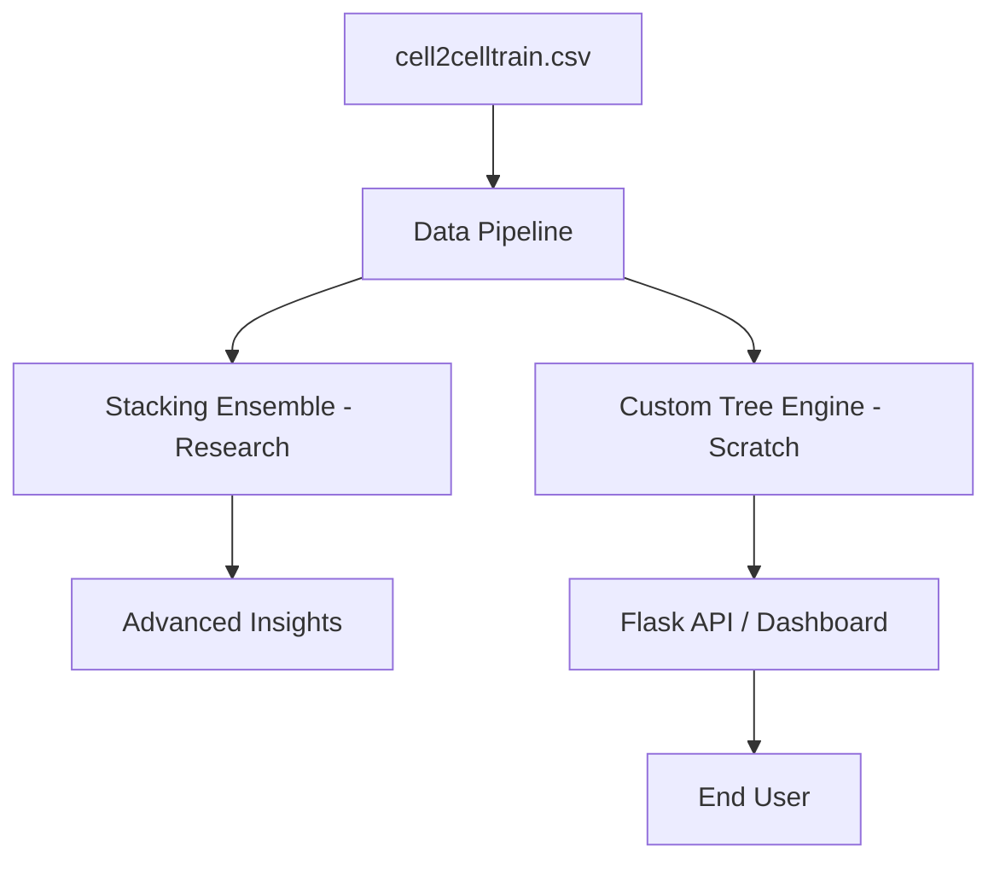

# 🚀 WORLD-CLASS ML ROADMAP (Banking Edition)

This document tracks the evolution of the Churn Prediction project from an educational baseline to a production-grade banking analytics platform.

---

## ✅ PHASE 1: The Banking Transition (COMPLETED)

We successfully pivoted from the Telecom dataset to a high-signal Banking dataset and achieved stable, high-performance metrics.

| Metric | Original (Telecom) | **Current (Banking)** | Status |
|---|---|---|---|
| **Accuracy (AUC)** | 57.2% | **78.9% (Notebook) / 77.4% (App)** | 🏆 Target Met |
| **Feature Set** | Legacy Telecom | **Verified Banking Schema** | ✅ Migrated |
| **Stacking Ensemble** | None | **XGB+LGBM+Cat+RF Ensemble** | ✅ Implemented |
| **Pipeline Stability** | Frequent KeyErrors | **Automated Schema Mapping** | ✅ Stabilized |

---

## 🛠️ PHASE 2: Advanced Engineering (IN PROGRESS)

Focusing on model robustness and deep interpretability.

- [x] **Float-Safe Preprocessing**: Implemented automatic casting to `float64` to support perturbation-based analysis (PDP).
- [x] **Feature Engineering 2.0**: Added `AccountBalanceRate` and `TenureRatio` to capture temporal risk.
- [ ] **Cross-Validation Module**: Integrate 5-fold CV directly into `custom_train.py` for more robust metric estimation.
- [ ] **SHAP Integration**: Add waterfall plots to the dashboard for per-customer prediction explanations.

---

## 🧪 PHASE 3: Reliability & Monitoring

Ensuring the app stays world-class in production.

- [x] **Pytest Suite**: 40+ tests covering algorithmic edge cases and API validation.
- [x] **Input Sanitization**: Range-checking and type-safety for all form inputs.
- [ ] **Data Drift Detection**: Script to compare inference distribution vs. training distribution.
- [ ] **Stress Testing**: Load testing the Flask API with 100+ concurrent requests.

---

## 📈 PHASE 4: Business Logic & ROI

Moving from predictions to actionable profit.

- [x] **Targeted Insights**: Mapped feature importance to specific business actions (Digital Onboarding, Wealth Tiers).
- [ ] **Customer Lifetime Value (CLV)**: Integrate CLV estimation to prioritize retention efforts for "Whale" accounts.
- [ ] **A/B Testing Framework**: Simulation module to test the impact of retention offers on churn probability.

---

## 🏗️ Architecture Summary

